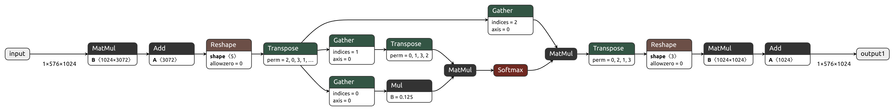
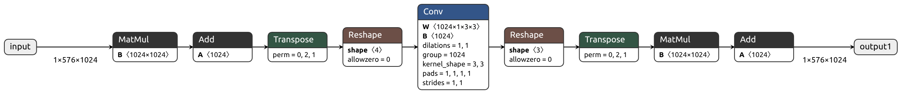
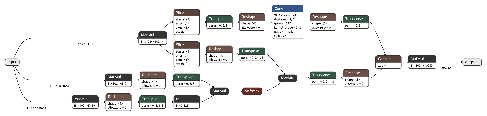
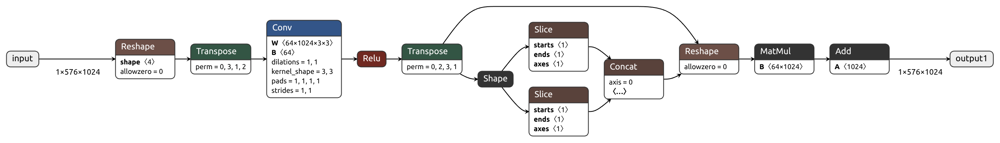
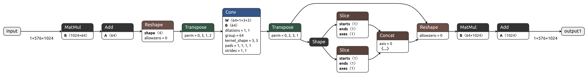

# Accelerating Vision Foundation Models with Drop-in Depthwise Convolution

**Carmelo Scribano**, **Mohammad Mahdi**, **Nedyalko Prisadnikov**, **Yuqian Fu**,  **Giorgia Franchini**, **Danda Pani Paudel**, **Marko Bertogna**, **Luc Van Gool**.\
*To be presented at ICPR 2026.*

## Premise
<p align="center">
  
</p>
<p align="center">
  <em>Multi-Head Self-Attention in ViTs (left) is approximated by depthwise convolution over the reshaped value tensor (right).</em>
</p>

We aim to reduce the inference cost of large pre-trained Vision Transformers (e.g., DINOv2) by replacing a subset of self-attention heads with depthwise convolutions applied to the reshaped value tensor. 

The workflow is as follows:

* Fine-tune the foundation model on the downstream task (e.g., semantic segmentation, classification).
* Select the attention heads to replace using the proposed criteria ($\Sigma_h$ or $\Sigma_b$), depending on the chosen granularity. Alternatively, DSP (Differentiable Subset Pruning) can be used to learn the selection via stochastic gating.
* Perform a second fine-tuning stage to recover performance and learn the convolution weights. By default, all parameters are updated; however, competitive results can be achieved by training only the added convolutional layers (~10% of the total parameters).

## Rqeuirements
This codebase is tested with PyTorch 2.5.1 and CUDA 12.1 under Python 3.11. You can create a suitable `conda` environment usin the provided `environment.yml`
```
$ conda env create -y -f environment.yml
```

## Code Structure
This repository does not include training or test code; instead, we provide a reference implementation for the proposed options, which are easier to understand and adapt to your existing training loop.

<details>

<summary>Source Tree</summary>

```
.
├── configs
│   ├── dw_12_blockwise_dsp.yaml
│   ├── dw_12_blockwise_ensemble.yaml
│   ├── dw_12_blockwise.yaml
│   ├── dw_192_scattered_dsp.yaml
│   ├── dw_192_scattered.yaml
│   └── full_12_ensemble_dsp.yaml
├── example_export.py
├── example_main.py
├── images
│   └── ...
├── lib
│   ├── __init__.py
│   ├── config.py
│   ├── convatt
│   │   ├── __init__.py
│   │   ├── convatt_dw.py
│   │   ├── convatt_full.py
│   │   ├── dsp.py
│   │   ├── extra.py
│   │   └── nop_attention.py
│   ├── deploy
│   │   └── __init__.py
│   │   ├── export_patches.py
│   ├── models
│   │   ├── ...
│   ├── patching
│   │   ├── __init__.py
│   │   ├── gumbel.py
│   │   └── patch.py
│   └── pruning
│       ├── __init__.py
│       ├── collect_stats.py
│       └── study_stats.py
├── README.md
└── weights
    └── download_dinov2.sh
```
</details>

### Configuration Files
Sample `.yaml` configuration files are provided in `./configs`. By default DinoV2 is used in this reference codebase (`backbone` entry).

### Training Patches

After finetuning on the downstream task, `apply_patches(..)` is called to perform the replacement. The `convatt` entry in the configuration file defines which strategy will be used in the second stage of fine-tuning.

* `conv_style`: accepted values [`depthwise`, `full`, `nop`]:

  * `depthwise` (default): approximate attention via depthwise convolution over the reshaped value tensor.
  * `full`: replace value projection and attention with a full convolution over the reshaped input. With `head_ensembling`, this is equivalent to SPViT; otherwise, slower.
  * `nop`: replace attention heads with identity (used for ablation).

* `conv_granularity`: accepted values [`blockwise`, `scattered`]:

  * `blockwise` (default): replace all heads in selected blocks; `blocks` must be a list of block indices.
  * `scattered`: replace specific heads; `blocks` must be a dict mapping block indices to lists of head indices.

* `head_ensembling`: boolean:

  * `false` (default): disabled.
  * `true`: merge heads within selected blocks into one; with `full`, equivalent to SPViT.

* `conv_selection`: accepted values [`manual`, `dsp`]:

  * `manual` (default): specify blocks/heads in config (e.g., using $\Sigma_b$ or $\Sigma_h$ criteria).
  * `dsp`: learn selection during fine-tuning via differentiable gating. In this case, other parameters should be set:    <details>
    ```
    gumbel_k: 12 # number of heads/blocks to select 
    tau: [ 1.0, 1e-3 ] # Initial/final tau values
    tau_decay_n: 30 # Number of tau decay epochs
    gates_lr: 0.01  # Selected learning-rate for DPS weights
    gates_wd: 0.0   # Disable weight decay for DSP weights
    gates_lr_fixed: false  # Whether to apply lr scheduler to DSP weights too.
    ```
    Please note that you have to implement the handling of these options in your training logic, according to your needs.
    </details>

Follow the provided `example_main.py` as an example.

⚠️ **Warning**: Not all combinations of these options are feasible. The function `patch_dinov2_convatt` automatically resolves the configuration file to select the appropriate implementation.

### Selection criteria
The `lib/pruning` package contains the implementation of the proposed selection criteria.
* `collect_stats.py`: runs inference on a subset of data and collects per-head attention statistics (mean and std), which are saved to disk.
* `study_stats.py`: loads the collected statistics, applies the $\Sigma_h$ or $\Sigma_b$ criteria, and returns the block or head indices to replace (based on prune_heads or prune_blocks).

### Export Patches
After the second stage finetuning, the model can be exported to `.onnx` for benchmarking and execution on inference frameworks (i.e, TensorRT). A set of patches is provided in the `lib/deploy` to simplify some of the proposed Convolution Attentions in an export-friendly format.\
Follow the provided `example_export.py` for reference usage.

## Examples

### Multi-Head Self Attention (MHSA)
<p align="center">
  
</p>

The standard self-attention mechanism is used in Vision Transformers.

### Depthwise Convolution — Blockwise Replacement
<p align="center">
  
</p>

All attention heads within a block are replaced by a depthwise convolution applied over the reshaped value tensor, providing a drop-in replacement while reducing computational complexity.

### Depthwise Convolution — Scattered Replacement
<p align="center">
  
</p>

A hybrid approach where standard attention heads and depthwise convolution heads coexist within the same attention block, enabling fine-grained control over efficiency vs. expressiveness trade-offs.

### SPViT — Full Convolution with Head Ensembling
<p align="center">
  
</p>

[SPViT](https://github.com/ziplab/SPViT) (Haoyu He et. al.) emerges as a special case where learned ensembling weights merge multiple attention heads into a single head. A full convolution kernel is constructed from the ensembled value projection weights.

### Depthwise Convolution with Head Ensembling
<p align="center">
  
</p>
The depthwise decomposition is applied to the SPViT setup, combining both architectural innovations for maximum efficiency gains.

## Reference
```
@inproceedings{scribano2026accelerating,
  title={Accelerating Vision Foundation Models with Drop-in Depthwise Convolution},
  author={Scribano, Carmelo and Mahdi, Mohammad and Prisadnikov, Nedyalko and Fu, Yuqian and Franchini, Giorgia and Paudel, Danda Pani and Bertogna, Marko and Van Gool, Luc},
  booktitle={International Conference on Pattern Recognition},
  pages={463--477},
  year={2026},
  organization={Springer}
}
```

## Acknowledgement
*This research was partially funded by the dAIedge project (HORIZON-CL4-2022-HUMAN-02-02, Grant Agreement Number: 101120726) and the Ministry of Education and Science of Bulgaria (support for INSAIT, part of the Bulgarian National Roadmap for Research Infrastructure).*
